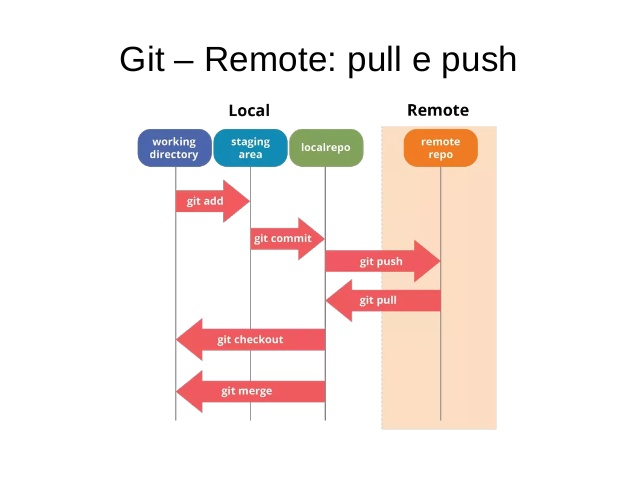
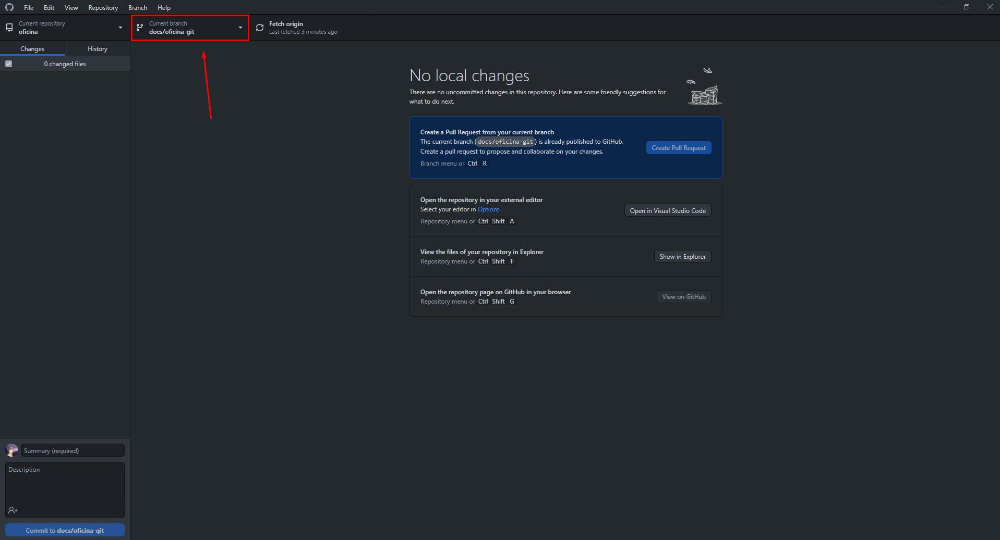
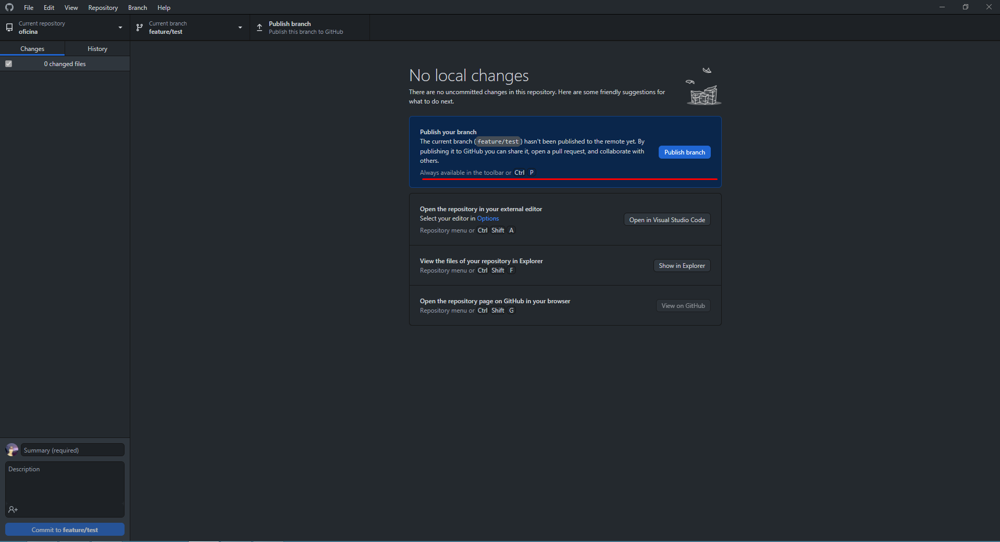
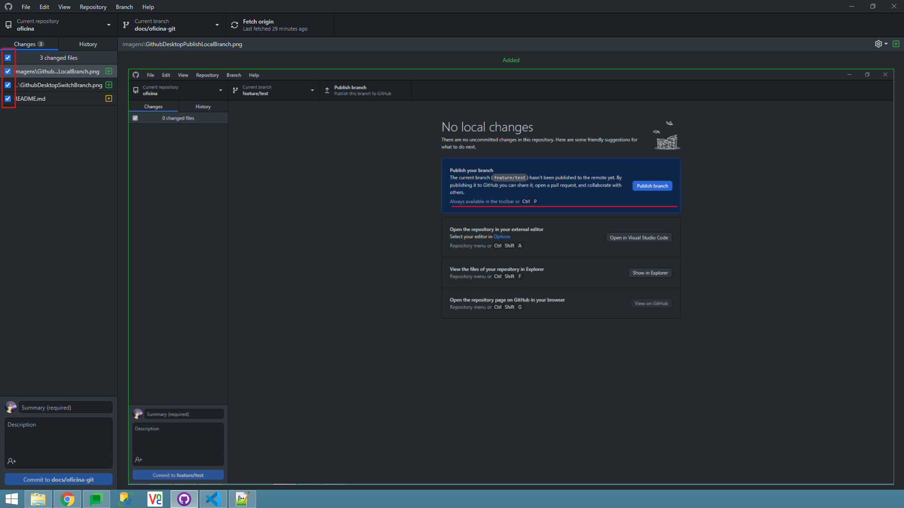
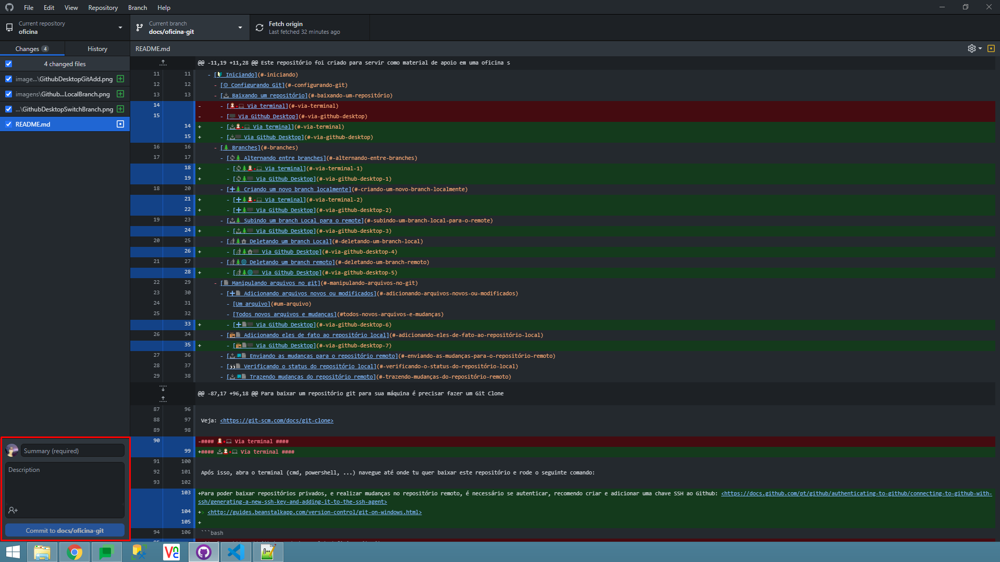
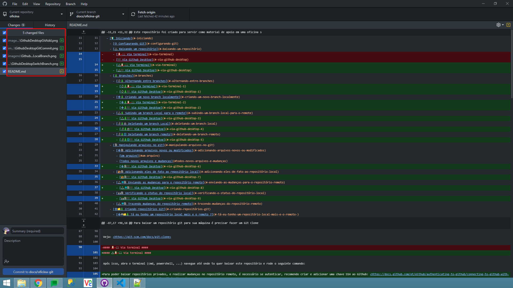
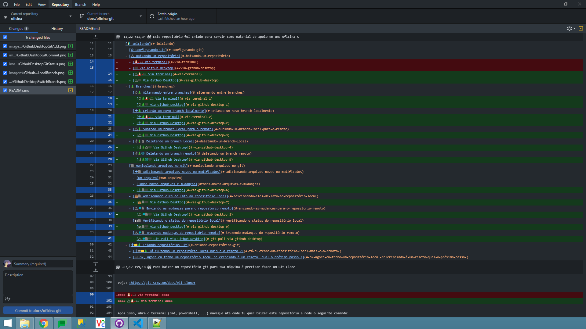

# :octocat: Oficina de Git e Github SchumannLabs [:link:](https://github.com/schumannlabs/oficina-git) #

Este repositório foi criado para servir como material de apoio em uma oficina sobre Git e Github feita na [@schumannlabs](https://github.com/schumannlabs).

[Guia de bolso](guia-de-bolso.md)

## 📑 Sumário ##

- [:octocat: Oficina de Git e Github SchumannLabs :link:](#octocat-oficina-de-git-e-github-schumannlabs-link)
  - [📑 Sumário](#-sumário)
  - [🔰 Iniciando](#-iniciando)
    - [⚙️ Configurando Git](#️-configurando-git)
    - [📥 Baixando um repositório](#-baixando-um-repositório)
      - [📥👩‍💻 Via terminal](#-via-terminal)
      - [📥📺 Via Github Desktop](#-via-github-desktop)
    - [🌲 Branches](#-branches)
      - [🔄🌲 Alternando entre branches](#-alternando-entre-branches)
        - [🔄🌲👩‍💻 Via terminal](#-via-terminal-1)
        - [🔄🌲📺 Via Github Desktop](#-via-github-desktop-1)
      - [➕🌲 Criando um novo branch localmente](#-criando-um-novo-branch-localmente)
        - [➕🌲👩‍💻 Via terminal](#-via-terminal-2)
        - [➕🌲📺 Via Github Desktop](#-via-github-desktop-2)
      - [📤🌲 Subindo um branch Local para o remote](#-subindo-um-branch-local-para-o-remote)
        - [📤🌲📺 Via Github Desktop](#-via-github-desktop-3)
      - [🚮🌲🏠 Deletando um branch Local](#-deletando-um-branch-local)
        - [🚮🌲🏠📺 Via Github Desktop](#-via-github-desktop-4)
      - [🚮🌲🌐 Deletando um branch remoto](#-deletando-um-branch-remoto)
        - [🚮🌲🌐📺 Via Github Desktop](#-via-github-desktop-5)
    - [📄 Manipulando arquivos no git](#-manipulando-arquivos-no-git)
      - [➕📄 Adicionando arquivos novos ou modificados](#-adicionando-arquivos-novos-ou-modificados)
        - [Um arquivo](#um-arquivo)
        - [Todos novos arquivos e mudanças](#todos-novos-arquivos-e-mudanças)
        - [➕📄📺 Via Github Desktop](#-via-github-desktop-6)
      - [📦📄 Adicionando eles de fato ao repositório local](#-adicionando-eles-de-fato-ao-repositório-local)
        - [📦📄📺 Via Github Desktop](#-via-github-desktop-7)
      - [📤🚚📄 Enviando as mudanças para o repositório remoto](#-enviando-as-mudanças-para-o-repositório-remoto)
        - [📤🚚📄📺 Via Github Desktop](#-via-github-desktop-8)
      - [👀📄 Verificando o status do repositório local](#-verificando-o-status-do-repositório-local)
        - [👀📄📺 Via Github Desktop](#-via-github-desktop-9)
      - [📥🚚📄 Trazendo mudanças do repositório remoto](#-trazendo-mudanças-do-repositório-remoto)
        - [📥🚚📄📺 Git Pull via Github Desktop](#-git-pull-via-github-desktop)
        - [📥🚚📄📺 Git Fetch via Github Desktop](#-git-fetch-via-github-desktop)
    - [➕📁🌲 Criando repositórios Git](#-criando-repositórios-git)
      - [➕📁🌲📺 Criar repositório local pelo Github Desktop](#-criar-repositório-local-pelo-github-desktop)
      - [➕☁️📁🌲 Tá eu tenho um repositório local mais e o remoto ?](#️-tá-eu-tenho-um-repositório-local-mais-e-o-remoto-)
      - [➕☁️📁🌲📺 Via Github Desktop](#️-via-github-desktop)
      - [💻 Ok, agora eu tenho um repositório local referenciado à um remoto, qual o próximo passo ?](#-ok-agora-eu-tenho-um-repositório-local-referenciado-à-um-remoto-qual-o-próximo-passo-)
  - [📣 FAQ](#-faq)
    - [❔ Git e Github são a mesma coisa ?](#-git-e-github-são-a-mesma-coisa-)
  - [🔎 Going Deeper](#-going-deeper)
  - [👥 Autores](#-autores)
    - [🦆 Ruan Pato](#-ruan-pato)
  - [📚 Referências](#-referências)

## 🔰 Iniciando ##

1. Instale o [Git](https://git-scm.com/downloads/) em seu computador: <https://git-scm.com/downloads/>, caso queira utilizar uma interface gráfica para usar o Git, recomendo o [Github Desktop](https://desktop.github.com/): <https://desktop.github.com/>.
2. [Crie uma conta](https://github.com/join) no Github - <https://github.com/join>;
3. Caso esteja usando Github Desktop, faça login que ele irá configurar o git com suas credenciais;
4. Caso esteja usando o Git via CLI na próxima secção tem os comandos que serão necessários;

Como funcionam repositórios git ?
Local é a versão do repositório que está baixada na máquina (e.g. Seu Computador), Remote é o repositório que está no servidor (e.g. Github);


Ref: <https://phpenthusiast.com/blog/the-essentials-of-git-and-github-for-web-developers>


Ref: <https://www.slideshare.net/tchelinux/git-em-pequenos-projetos-sandro-custdio-tchelinux-livramento-2019>

Veja: <https://git-scm.com/book/en/v2/Getting-Started-About-Version-Control>

### ⚙️ Configurando Git ###

Ao modificar configurações do git, pode-se escolher o escopo destas, seja no repositório onde a pasta .git/ está, ou para todos os repositórios git no computador;

E.g. Configurando um mesmo user.name para todos repositórios git no computador:

```bash
> git config --global user.name "exemploschumann"
```

No exemplo acima todos repositórios git usaram o user.name exemploschumann para se comunicar com o repositório origem.

E.g. Configurando um email para apenas um repositório:

```bash
C:/Users/exemplo/Documents/oficina-git> git config user.email "exemplo1@schumann.com.br"
```

O user.name e user.email são obrigatórios para usar o git, porém existem várias outras configurações que podem ser alteradas, pode-se vê-las usando:

```bash
git config --list
```

Veja: <https://git-scm.com/docs/git-config>

### 📥 Baixando um repositório ###

Para baixar um repositório git para sua máquina é precisar fazer um Git Clone, que cria uma versão do que está na nuvem em sua máquina local.

Veja: <https://git-scm.com/docs/git-clone>

#### 📥👩‍💻 Via terminal ####

Após isso, abra o terminal (cmd, powershell, ...) navegue até onde tu quer baixar este repositório e rode o seguinte comando:

Para poder baixar repositórios privados, e realizar mudanças no repositório remoto, é necessário se autenticar, recomendo criar e adicionar uma chave SSH ao Github: <https://docs.github.com/pt/github/authenticating-to-github/connecting-to-github-with-ssh/generating-a-new-ssh-key-and-adding-it-to-the-ssh-agent>
> <http://guides.beanstalkapp.com/version-control/git-on-windows.html>

```bash
git clone git@github.com:schumannlabs/oficina-git.git
```

#### 📥📺 Via Github Desktop ####

1. Vá em File -> Clone Repository (Ou pressione: *Ctrl + Shift + O*);
2. Selecione URL -> Adicione a URL deste repositório, escolha o local onde o repositório será baixado.

### 🌲 Branches ###


Pode se definir cruamente, como se Branches fossem 'cópias' do projeto de um determinado ponto (commit)

>Mas isso significa que o projeto vai ter tamanho de multiplicado pelo número de branches que ele tiver ?
>
>Não. Pois o git trabalha com referências.
>
> Veja:
>
> <https://git-scm.com/book/en/v2/Git-Internals-Git-References>
>
> <https://www.freecodecamp.org/news/git-internals-for-curious-developers-a1e44e7ecafe/#:~:text=In%20other%20words%2C%20Git%20copies,what%20makes%20Git%20so%20quick.>

Veja:

- Site para treinar uso de branches: <https://learngitbranching.js.org/?locale=pt_BR>
- <https://git-scm.com/docs/git-branch>
- <https://git-scm.com/docs/git-checkout>
- <https://git-scm.com/docs/git-switch>
- <https://git-scm.com/docs/git-merge>
- <https://git-scm.com/docs/git-mergetool>
- <https://git-scm.com/docs/git-log>
- <https://git-scm.com/docs/git-stash>
- <https://git-scm.com/docs/git-tag>
- <https://git-scm.com/docs/git-worktree>

#### 🔄🌲 Alternando entre branches ####

Suponde que você está em um repositório que possui vários branches, pode-se alterar localmente a versão dos arquivos de acordo com o branch usando o seguinte comando:

##### 🔄🌲👩‍💻 Via terminal #####

```bash
git checkout homologation
```

##### 🔄🌲📺 Via Github Desktop #####



#### ➕🌲 Criando um novo branch localmente ####

Quando vai se criar um novo branch, deve-se dizer à partir de qual este será criado.

##### ➕🌲👩‍💻 Via terminal #####

Pode-se utilizar o checkout para criar um novo branch a partir do atual:

```bash
git checkout -b feature/9221
```

##### ➕🌲📺 Via Github Desktop #####

1. Vá em Branch -> New Branch (Ou pressione: *Ctrl + Shift + N*);
2. Digite o nome do novo branch, ex: feature/nomeBranch e selecione a partir de qual branch esse será criado.

#### 📤🌲 Subindo um branch Local para o remote ####

```bash
git push -u origin HEAD
```

**-u** = --set-upstream

##### 📤🌲📺 Via Github Desktop #####



#### 🚮🌲🏠 Deletando um branch Local ####

```bash
git branch -d feature/9221
```

##### 🚮🌲🏠📺 Via Github Desktop #####

1. Vá em Branch -> Delete Branch (Ou pressione: Ctrl + Shift + D);
2. Confirme na caixa de dialogo que quer deleter.

#### 🚮🌲🌐 Deletando um branch remoto ####

```bash
git push origin --delete feature/9221
```

##### 🚮🌲🌐📺 Via Github Desktop #####

1. Vá em Branch -> Delete Branch (Ou pressione: Ctrl + Shift + D);
2. Digite o nome do novo branch, ex: feature/nomeBranch e selecione a partir de qual branch esse será criado.

### 📄 Manipulando arquivos no git ###

Para explicar manipulação de arquivos vou usar a forma que este [artigo](https://dev.to/sublimegeek/git-staging-area-explained-like-im-five-1anh#:~:text=You%20can%20take%20stuff%20out,that%20box%20are%20your%20changes.) fez.

#### ➕📄 Adicionando arquivos novos ou modificados ####

Imagine que a área de staging do git é como uma caixa que está na sua mesa, onde tu pode adicionar objetos, seja um por vez, ou todos, para isso usamos o **git add**.

Veja: <https://git-scm.com/docs/git-add>

##### Um arquivo #####

```bash
git add gambiarra/4952.cpp
```

##### Todos novos arquivos e mudanças #####

```bash
git add .
```

ou

```bash
git add -A
```

##### ➕📄📺 Via Github Desktop #####

O equivalente ao git add, são as caixas de seleção dos arquivos:



Os que estão selecionados irão para staging area, como se fosse um git add nestes.

#### 📦📄 Adicionando eles de fato ao repositório local ####

Quando você tem uma caixa que está com objetos, para envia-las para o depósito se faz necessário fecha-la e rotular a mesma, para isso usa-se o git **commit**.

```bash
git commit -m "Título do Rótulo da caixa" -m "Mais informações sobre a caixa no rótulo" -m "Pode-se usar o -m várias vezes, ele cria como se fossem paragráfos a cada novo -m" -m "Lembre-se de escrever títulos curtos e descritivos no título do commit"
```

**Hack:**
Você pode também simplesmente ao invés de usar o git add para adicionar cuidadosamente os itens na "caixa" usar a flag -a no commit sem ter usado o git add antes, que é como se você passasse o braço na mesa jogasse todos os itens dela na caixa, já colocar fechar e rotular ela.

```bash
git commit -a -m "Jogando tudo da mesa na caixa" -m "Literalmente adicionando toda e qualquer mudança que ocorreu no Working Directory para o repositório"
```

Veja: <https://git-scm.com/docs/git-commit>

##### 📦📄📺 Via Github Desktop #####

Para realizar um commit, basta preencher a mensagem de commit, colocar descrição ou co-autor caso queira e então clicar em commit:



Os que estão selecionados irão para staging area, como se fosse um git add nestes.

#### 📤🚚📄 Enviando as mudanças para o repositório remoto ####

É como se você pegasse todas as caixas que estão prontas para serem transportadas e as entregasse para um serviço que vai "magicamente" criar cópias delas e leva-las ao seu depósito, para fazer isso deve-se usar o **git push**

```bash
git push
```

Obs. O serviço que vai entregar essas mudanças vai conferir primeiro se o que enviou pode ser entregue, pois pode ser que exista conflitos.

##### 📤🚚📄📺 Via Github Desktop #####

Para realizar um commit, basta preencher a mensagem de commit, colocar descrição ou co-autor caso queira e então clicar em commit:


Os que estão selecionados irão para staging area, como se fosse um git add nestes.

#### 👀📄 Verificando o status do repositório local ####

Para ver o que tem na caixa que está na sua mesa, nas caixas que estão ao seu redor, ou em ambas usa-se o comando **git status**:

```bash
git status
```

Veja: <https://git-scm.com/docs/git-status>

##### 👀📄📺 Via Github Desktop #####

As mudanças no seu repositório, são visíveis na barra lateral esquerda, no mesmo local onde tu escolhe se vai adicionar ou não a mudança do arquivo ao próximo commit:

;

#### 📥🚚📄 Trazendo mudanças do repositório remoto ####

Lembra do depósito que foi comentado antes (repositório remoto), quando é preciso trazer as coisas que estão nele para você (repositório local) pode-se usar dois comandos **git fetch** ou **git pull**, mas qual a diferença ?

O **git fetch** verifica as mudanças que ocorreram no depósito, e traz apenas as que não vão conflitar com as locais, é como se as caixas que estão aqui, apenas fossem ganhar novos objetos, e não perder nenhum.

Veja: <https://git-scm.com/docs/git-fetch>

Já o **git pull** traz todas as mudanças que ocorreram lá, podendo remover objetos, ou mudar estes que estão localmente.

Veja: <https://git-scm.com/docs/git-fetch>

##### 📥🚚📄📺 Git Pull via Github Desktop #####

1. Vá em Repository -> Pull (Ou pressione: *Ctrl + Shift + P*);

##### 📥🚚📄📺 Git Fetch via Github Desktop #####

Basta clicar em Fetch:



### ➕📁🌲 Criando repositórios Git ###

Como eu crio um repositório Git local 🏠 ?
Para isso utiliza-se o comando **git init** dentro de uma pasta, que irá "transformar" essa em um repositório Git.

```bash
git init
```

#### ➕📁🌲📺 Criar repositório local pelo Github Desktop ####

1. Vá em File -> New Repository (Ou pressione *Ctrl + N*)
2. Preencha as informações, e seleciona as opções que deseja.

#### ➕☁️📁🌲 Tá eu tenho um repositório local mais e o remoto ? ####

Devemos seguir a arquitetura do Git, para isso é necessário um repositório remoto, como estamos usando Github nesta oficina, deve-se criar um repositório lá e dizer para nosso repositório local que aquele é o remoto, para isso usamos o **git add remote**:

```bash
git add remote https://github.com/nomeDoSeuUsuario/nomeDoRepositorioRemoto
```

#### ➕☁️📁🌲📺 Via Github Desktop ####

Com o repositório local criado e selecionado pelo Github Desktop, será possível criar o Remoto usando o atalho *Ctrl + P*, ou clicando em uma das opções de publicar o mesmo:


#### 💻 Ok, agora eu tenho um repositório local referenciado à um remoto, qual o próximo passo ? ####

Agora tu pode já manipular os arquivos, por exemplo adicionando ([*git add*](#-adicionando-arquivos-novos-ou-modificados)) algo ao repositório local, commitando ([*git commit*](#-adicionando-eles-de-fato-ao-repositório-local)) e então enviando eles ao remoto ([*git push*](#-enviando-as-mudanças-para-o-repositório-remoto)).

## 📣 FAQ ##

### ❔ Git e Github são a mesma coisa ? ###

>Não

- **Git:** Uma ferramenta de controle de versão distribuído;
- **Github:** Plataforma de hospedagem de códigos fontes/arquivos que usa o Git para controle de versão, além de servir também como um comunidade.

## 🔎 Going Deeper ##

- Explicação das estruturas computacionais/matemáticas que o git usa em sua construção: <https://stackoverflow.com/a/18588431>;
- Página estilo slide de Conceitos do Git Simplificados: <https://gitolite.com/gcs#(1)>;
- Git for Computer Scientists <https://eagain.net/articles/git-for-computer-scientists/>.

## 👥 Autores ##

### 🦆 Ruan Pato ###

Criador da primeira versão do material da primeira oficina sobre o assunto.

- [Perfil pessoal do Github](https://github.com/ruanpato);
- [Perfil da schumannlabs do Github](https://github.com/ruanpatoschumann).

Caso tenha alguma dúvida basta mandar um email ou me contatar pelos meios de comunicação usados pela SchumannLabs, basta pesquisar por Ruan Pato ou Ruan Guerra.

## 📚 Referências ##

- [Git Docs](https://git-scm.com/docs) - <https://git-scm.com/docs>;
- [Github Docs](https://docs.github.com/pt/github/getting-started-with-github/quickstart) - <https://docs.github.com/pt/github/getting-started-with-github/quickstart>;

**Imagens:**

- [Imagem 1](https://stackoverflow.com/a/20755706) - <https://stackoverflow.com/a/20755706>;

**Links Uteis:**

- Cursos sobre uso de Git e Github: <https://lab.github.com/>;
